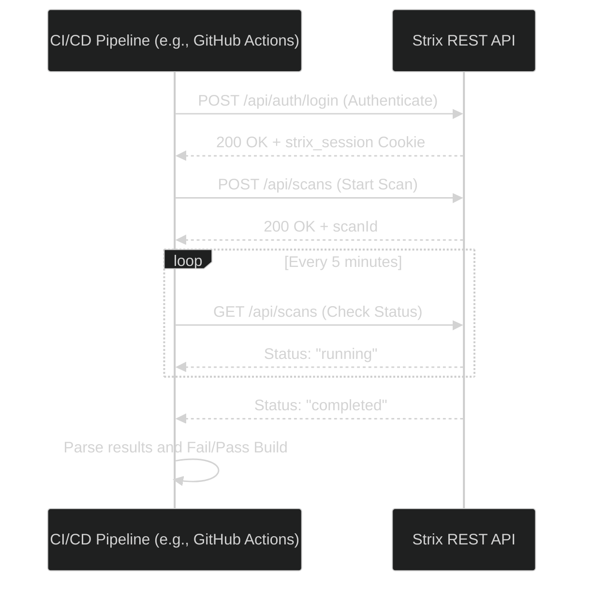

# REST API Reference

Strix provides a fully functional RESTful API built on Next.js Route Handlers. You can interact with these endpoints programmatically to integrate Strix into your CI/CD pipelines or custom dashboards.

Below is a detailed breakdown of every major endpoint. Click on any endpoint to expand its details.



## Authentication Endpoints

::: details POST `/api/auth/register`
**Description:** Registers a new user account. The first user named `admin` will automatically receive the `ADMIN` role.

**Headers:**
- `Content-Type: application/json`

**Request Body:**
```json
{
  "username": "security_team",
  "password": "SecurePassword123!"
}
```

**Response (200 OK):**
```json
{
  "message": "User registered successfully",
  "user": {
    "id": 2,
    "username": "security_team",
    "role": "USER"
  }
}
```
*(Note: This endpoint also automatically logs the user in by setting the `strix_session` cookie).*
:::

::: details POST `/api/auth/login`
**Description:** Authenticates an existing user and issues an HTTP-only JWT session cookie.

**Headers:**
- `Content-Type: application/json`

**Request Body:**
```json
{
  "username": "admin",
  "password": "SecurePassword123!"
}
```

**Response (200 OK):**
```json
{
  "message": "Logged in successfully"
}
```
:::

::: details GET `/api/auth/me`
**Description:** Returns the profile and role of the currently authenticated user based on their session cookie.

**Headers:**
- `Cookie: strix_session=<jwt>`

**Response (200 OK):**
```json
{
  "user": {
    "id": 1,
    "username": "admin",
    "role": "ADMIN"
  }
}
```
:::

::: details POST `/api/auth/logout`
**Description:** Destroys the current user session by clearing the `strix_session` cookie.

**Response (200 OK):**
```json
{
  "message": "Logged out successfully"
}
```
:::

---

## Scan Endpoints

::: details GET `/api/scans`
**Description:** Retrieves a list of all scans. Regular users see only their own scans; Admins see scans from all users.

**Headers:**
- `Cookie: strix_session=<jwt>`

**Response (200 OK):**
```json
{
  "scans": [
    {
      "id": "550e8400-e29b-41d4-a716-446655440000",
      "targetUrl": "https://example.com",
      "status": "completed",
      "model": "gpt-4o",
      "createdAt": "2026-08-07T12:00:00.000Z"
    }
  ]
}
```
:::

::: details POST `/api/scans`
**Description:** Initiates a new autonomous pentest. This instantly spawns the Strix Python agent in the background.

**Headers:**
- `Content-Type: application/json`
- `Cookie: strix_session=<jwt>`

**Request Body:**
```json
{
  "targetUrl": "https://example.com",
  "model": "claude-3-5-sonnet",
  "mode": "standard",
  "customInstructions": "Focus entirely on SQL Injection in the /login panel",
  "apiKeys": {
    "openai": "",
    "anthropic": "sk-ant-...",
    "openrouter": ""
  }
}
```

**Response (200 OK):**
```json
{
  "message": "Scan started successfully",
  "scanId": "550e8400-e29b-41d4-a716-446655440000"
}
```
:::

::: details POST `/api/scans/resume`
**Description:** Resumes a failed or stopped scan from the exact point it stopped, using the data from the previous UUID.

**Headers:**
- `Content-Type: application/json`
- `Cookie: strix_session=<jwt>`

**Request Body:**
```json
{
  "previousRunId": "550e8400-e29b-41d4-a716-446655440000",
  "overrideModel": "gpt-4o",
  "apiKeys": {
    "openai": "sk-proj-...",
    "anthropic": "",
    "openrouter": ""
  }
}
```

**Response (200 OK):**
```json
{
  "message": "Scan resumed successfully",
  "newScanId": "990e8400-e29b-41d4-a716-446655441111"
}
```
:::

::: details DELETE `/api/scans/bulk`
**Description:** Deletes multiple scans in a single request.

**Headers:**
- `Content-Type: application/json`
- `Cookie: strix_session=<jwt>`

**Request Body:**
```json
{
  "ids": ["550e8400-e29b-41d4-a716-446655440000", "990e8400-e29b-41d4-a716-446655441111"]
}
```

**Response (200 OK):**
```json
{
  "message": "Scans deleted successfully"
}
```
:::

::: details POST `/api/scans/[id]/schedule`
**Description:** Sets a recurring cron schedule for an existing scan configuration.

**Headers:**
- `Content-Type: application/json`
- `Cookie: strix_session=<jwt>`

**Request Body:**
```json
{
  "cron": "0 0 * * 0" // Run every Sunday at midnight
}
```

**Response (200 OK):**
```json
{
  "message": "Schedule created successfully"
}
```
:::

---

## Analytics Endpoints

::: details GET `/api/analytics`
**Description:** Retrieves statistical data and charts information for the dashboard.

**Headers:**
- `Cookie: strix_session=<jwt>`

**Response (200 OK):**
```json
{
  "totalScans": 150,
  "criticalVulns": 12,
  "activeAgents": 2
}
```
:::

---

## Streaming Endpoints

::: details GET `/api/scans/[id]/stream`
**Description:** A Server-Sent Events (SSE) endpoint that streams the live terminal logs of an active agent directly to the client.

**Headers:**
- `Accept: text/event-stream`
- `Cookie: strix_session=<jwt>`

**Response (Streaming Event):**
```text
data: {"type": "log", "message": "[*] Initiating standard scan against https://example.com"}

data: {"type": "log", "message": "[+] Form found on /login. Attempting SQLi payload."}
```
:::
