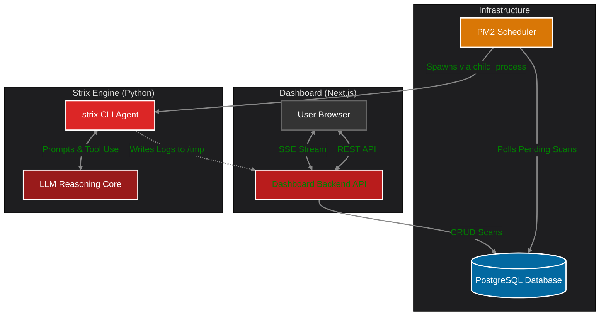

# System Overview

Project Strix relies on a decoupled, asynchronous architecture.

- **Frontend:** Next.js App Router (React)
- **Backend:** Next.js API Routes (Node.js)
- **Database:** PostgreSQL (managed by Prisma ORM)
- **AI Core:** Python 3 (CLI Agent)
- **Scheduler:** PM2 Node.js daemon

## System Architecture Diagram

When a user initiates a scan from the UI, the Next.js API stores the configuration in PostgreSQL. It then uses Node's `child_process` to spawn the `strix` Python executable in the background, passing the UUID and parameters. The Python process operates entirely independently, logging its findings to temporary files, which the Node.js API streams back to the UI via Server-Sent Events.
