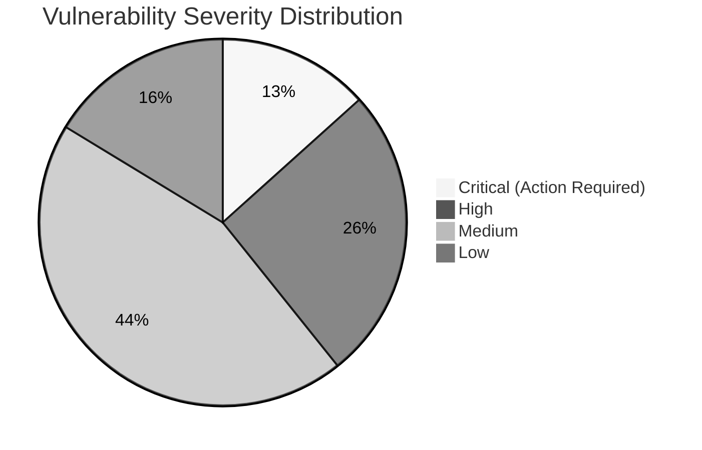
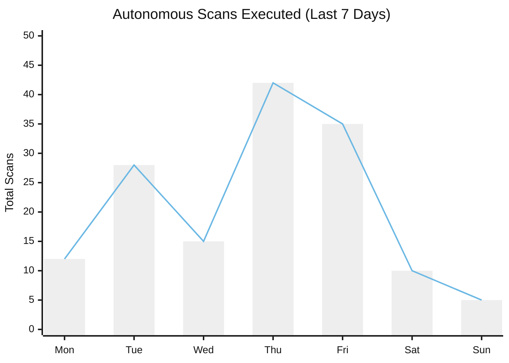

# Analytics & Charts

The Strix Dashboard Overview page features a powerful Analytics panel built using **Recharts**, a composable charting library built on React components.

## Severity Distribution
The primary chart you will interact with is the Severity Distribution pie/donut chart. 
As the autonomous AI agents perform scans across your targets, they classify vulnerabilities into four standard categories:
- **Critical** (Red)
- **High** (Orange)
- **Medium** (Yellow)
- **Low** (Blue)

This chart gives you an immediate visual representation of your risk exposure. A high concentration of critical findings indicates a need for immediate remediation.

## Scan Volume Over Time

The system also tracks your pentesting velocity. You can view how many autonomous scans were executed per day.

## Real-Time Reactivity
Unlike static reporting tools, Strix's charts are completely reactive. 
When a scan is actively running in the background, the UI listens for Server-Sent Events (SSE). The exact second the AI agent identifies a new SQL Injection and flags it as "High", the High counter increments, and the chart animations update smoothly without a page reload.

*(Note: In previous versions, Strix utilized a Live Graph for visualizing node-based logic. This has been deprecated in favor of the more universally understood Analytics Charts for better management reporting).*
