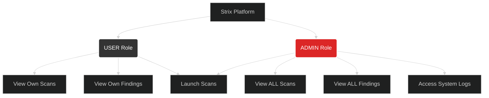

# Role-Based Access Control (RBAC)

Project Strix uses a strict authorization model to prevent unauthorized viewing of vulnerability data.

## The Roles

There are two primary roles in the system:
1. `USER`
2. `ADMIN`

### The `USER` Role
When a new account is registered on the platform, it is automatically assigned the `USER` role. 
Users operate in an isolated environment (tenant-like).
- They can only view scans they have personally created.
- They can only view vulnerabilities associated with their own scans.
- They cannot access the System Logs tab.

### The `ADMIN` Role
The `ADMIN` role is a superuser. 
- Admins can view **all** scans created by any user on the system.
- Admins have access to the **System Logs** dashboard to monitor API traffic, scheduler heartbeats, and internal application errors.

## How to become an Admin
For security and simplicity, the `ADMIN` role is currently hardcoded to the exact username:
`admin` (case-sensitive).

To create the administrator account:
1. Go to the Registration page.
2. Enter the username exactly as `admin`.
3. Choose a strong password.

Once registered, this specific account will possess global visibility across the entire Strix platform. All subsequent users (e.g., `john`, `security_team`) will be restricted `USER` accounts.
