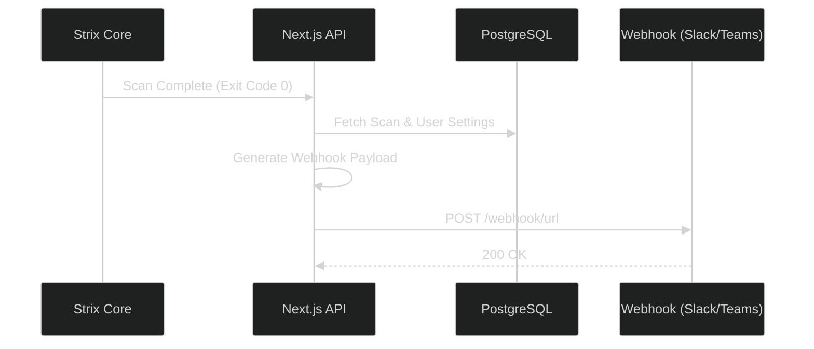

# Webhooks & Integrations

Strix can push real-time alerts to external communication channels (like Slack, Microsoft Teams, or custom HTTP listeners) so your security team is notified the exact second a vulnerability is found.

## Webhook Architecture



## Configuring a Webhook

1. Navigate to the **Settings** tab in the Dashboard.
2. Scroll to the **Notifications** section.
3. Paste your Webhook URL (e.g., from your Slack App configuration).
4. Select your notification triggers:
   - **Notify on Start:** Sends a message when a scan begins.
   - **Notify on Finish:** Sends a summary message when a scan completes, including the number of vulnerabilities found.

## Payload Structure

When Strix fires a webhook, it sends a JSON payload. If you are building a custom listener, expect the following structure:

```json
{
  "event": "scan.finish",
  "scanId": "123e4567-e89b-12d3-a456-426614174000",
  "target": "https://example.com",
  "status": "completed",
  "vulnCount": 3,
  "timestamp": "2026-08-10T12:00:00Z"
}
```

> [!CAUTION]
> Treat your Webhook URLs as secrets. If leaked, malicious actors could spam your Slack channels with false alerts.
