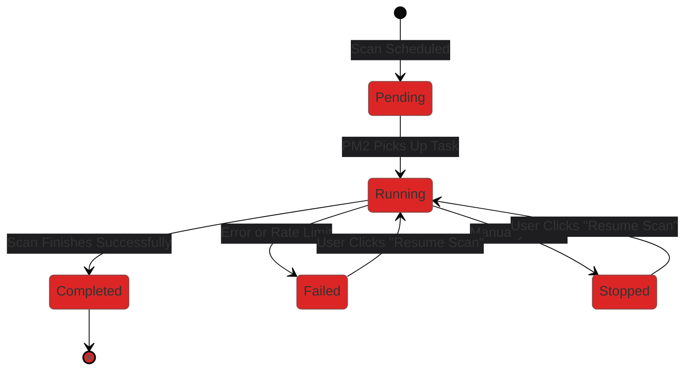

# Creating Scans

Initiating a new autonomous pentest in Strix is designed to be as simple as deploying a traditional static scanner, while offering significantly more power.

## Step-by-Step Guide

1. Navigate to the **Scans** tab from the main navigation menu.
2. Click the **+ New Scan** button in the top right corner. This will open the Scan Configuration Modal.
3. **Target Type:** Choose whether you are scanning a single target URL or uploading a Target List (a `.txt` file with multiple URLs).
4. **Target URL:** Enter the primary scope of the scan (e.g., `https://example.com`).
5. **AI Model Selection:** Select the Large Language Model that will act as the brain of the scanning agent. (Ensure you have the required API keys saved in your Settings).
6. **Custom Instructions (Optional):** This is where Strix shines. You can provide natural language context to the AI (e.g., "This application uses GraphQL at `/api/graphql`. Focus on testing mutation endpoints for IDOR").
7. **Scan Mode:** Select the intensity of the scan (`quick`, `standard`, `deep`).
8. **Schedule (Optional):** If you want the scan to run immediately, leave this blank. Otherwise, select a future date and time.
9. **Recurrence (Optional):** Set the scan to run `Daily`, `Weekly`, or `Monthly`.
10. Click **Launch Scan**.

Upon clicking launch, the Next.js backend will store the configuration in PostgreSQL and immediately spawn a background Python process (`strix` CLI) to begin the autonomous assessment.

## Scan Lifecycle

