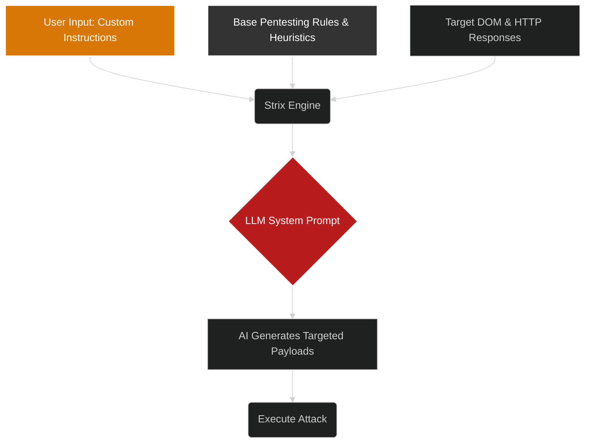

# Custom Instructions

One of the most powerful features of Project Strix is the ability to steer the autonomous AI agent using natural language prompts. This transforms Strix from a generic scanner into a highly specialized penetration testing assistant.

## How it works

When you provide Custom Instructions in the "New Scan" modal, tThese instructions are directly embedded into the System Prompt of the AI agent, effectively acting as an unbreakable directive for that specific scan.

## Examples of Custom Instructions

### 1. Focused Testing
Instead of letting the AI wander across the entire application, you can restrict its focus:
> "Ignore the blog and marketing pages. Focus entirely on the `/dashboard` and `/api/v2` paths. Prioritize testing for Insecure Direct Object References (IDOR) and Mass Assignment vulnerabilities."

### 2. Providing Credentials
Since Strix acts as an intelligent agent, it knows how to fill out forms. You can provide credentials directly in the instructions so it can perform authenticated scans:
> "You can log in to the application at `/login`. Use the username `testuser@example.com` and the password `TestPassword123!`. Once logged in, attempt to access the `/admin` panel to check for broken privilege escalation."

### 3. Contextual Business Logic
You can explain complex business logic to the AI so it knows what a "vulnerability" looks like in the context of your specific app:
> "This application allows users to transfer funds. A user should not be able to transfer a negative amount, and they should not be able to transfer more than their current balance. Test the `/api/transfer` endpoint aggressively to see if you can bypass these business rules."

By leveraging custom instructions, you maximize the LLM's reasoning capabilities, finding deep logical flaws that automated scanners could never comprehend.
