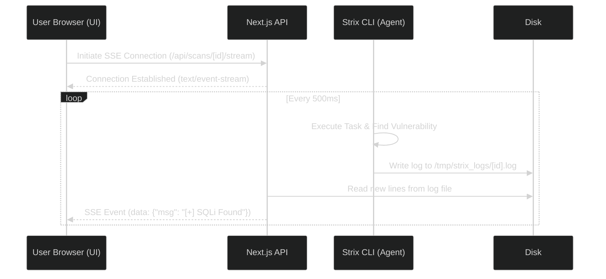

# Real-Time Streaming

A core design principle of Project Strix is transparency. When an autonomous AI agent is interacting with your infrastructure, you should never be left in the dark wondering what it is doing.

## The Live Terminal

When you open the details page of an actively running scan, you will see an embedded terminal window powered by `xterm.js`. 

This terminal streams the internal logs of the Python core agent in real-time. You will see:
- The agent fetching HTML and parsing DOM structures.
- The exact API payloads the agent is constructing.
- The reasoning and "thought process" of the LLM (e.g., "I notice a token in the URL, I will try to remove it to check for authorization bypass").
- Errors, rate limits, and network timeouts as they happen.

## How it works technically
Instead of forcing you to refresh the page to see if a 4-hour pentest is making progress, Strix utilizes **Server-Sent Events (SSE)** to stream the internal thoughts and terminal output of the AI directly to your browser in real-time.

## How It Works Under the Hood
1. The Python agent writes its output to a temporary log file located at `/tmp/strix_runs/<uuid>/agent.log`.
2. The Next.js backend uses a `tail -f` like mechanism to watch this file.
3. The browser connects to the Next.js backend via **Server-Sent Events (SSE)**.
4. As new lines are appended to the log file on the server, they are instantly streamed over the SSE connection to the React frontend, which renders them in the `xterm.js` component.

## Live Findings
Alongside the terminal, any vulnerabilities discovered by the agent are instantly pushed to the UI via the same SSE mechanism. You do not need to refresh the page to see new critical findings; they will pop up on your screen the millisecond the AI confirms them.
