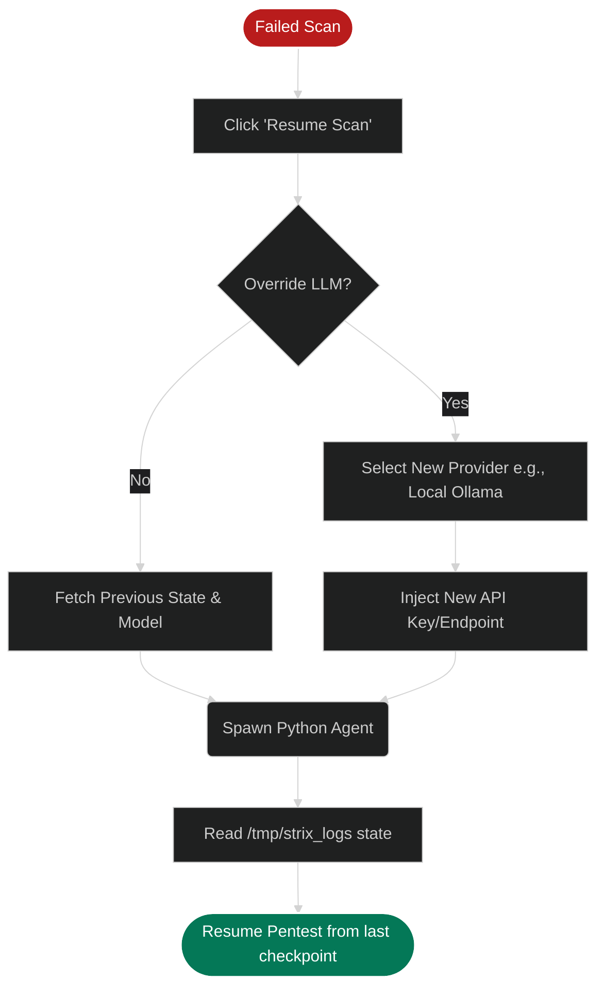

# Intelligent Scan Resumption

Pentesting large applications can take hours. Occasionally, scans might fail due to unforeseen circumstances:
- A sudden network outage drops the connection to the target.
- The target server implements rate-limiting and blocks the agent.
- You run out of API credits on your chosen LLM provider (e.g., OpenAI).
- You manually stopped the scan to investigate an issue.

Strix includes a powerful **Intelligent Scan Resumption** feature that allows you to pick up exactly where you left off, rather than starting a 4-hour scan from scratch.

## How to Resume a Scan

1. Go to the **Scans** list on the Dashboard.
2. Locate the scan that `failed` or was `stopped`.
3. Click on the Scan ID badge (e.g., `550e8400...`). This will instantly copy the unique UUID to your clipboard.
4. Click the **Resume Scan** button located next to the "+ New Scan" button.
5. Paste the UUID into the **Previous Run ID** field.
6. Click **Resume Scan**.

The Strix backend will query the database, fetch the exact target, custom instructions, and modes used in the previous run, restore the state, and restart the agent.

## Dynamic LLM Overriding

A common reason for scan failure is exhausting your API credits on a premium model (like GPT-4o). 

If this happens, you can use the **Override LLM Model** feature during resumption:
1. When pasting the UUID in the Resume modal, check the **"Override LLM Model?"** checkbox.
2. A dropdown will appear allowing you to select a different provider (e.g., switching to OpenRouter or a local Ollama model).
3. The scan will resume its task using the new "brain", completely bypassing the API limits of the previous provider.
