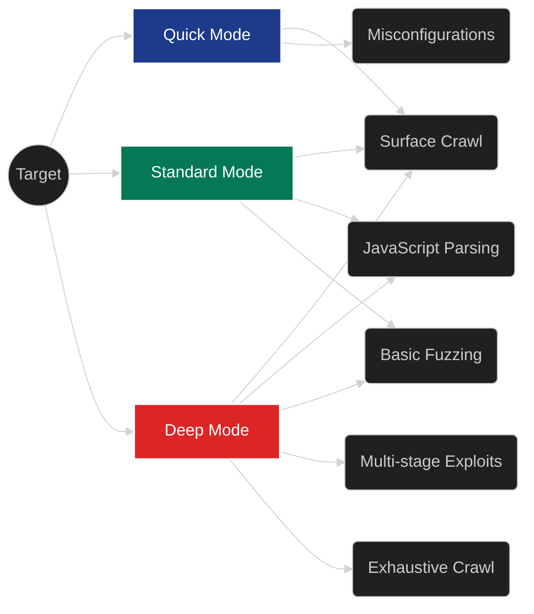

# Scan Modes

When creating a new scan, you must define the "Scan Mode" (or intensity). This dictates how aggressively the AI agent will interact with the target application, and how deep it will crawl.

## 1. Quick Mode
- **Description:** Designed for rapid reconnaissance and identifying low-hanging fruit.
- **Behavior:** The AI agent will perform a surface-level crawl of the target URL, look for exposed `.git` directories, check for common misconfigurations (like missing security headers), and quickly assess the main page functionality.
- **Use Case:** Daily automated health checks or initial scoping before a deeper engagement.
- **Duration:** Typically 1 to 5 minutes.

## 2. Standard Mode
- **Description:** The default mode, offering a balanced approach between speed and depth.
- **Behavior:** The agent will aggressively crawl the application, parse JavaScript files to find hidden API endpoints, attempt basic fuzzing on input fields (SQLi, XSS), and evaluate business logic on authenticated endpoints if credentials were provided via Custom Instructions.
- **Use Case:** Weekly compliance checks and standard application security testing.
- **Duration:** 10 to 30 minutes, depending on the target size.

## 3. Deep Mode
- **Description:** The most aggressive and thorough setting. The AI acts as a relentless, focused penetration tester.
- **Behavior:** The agent will exhaustively crawl every link, bypass basic rate limits (by pausing intelligently), fuzz all parameters with extensive mutation payloads, test for complex multi-stage vulnerabilities (e.g., Stored XSS leading to Account Takeover), and heavily utilize the LLM's reasoning capabilities to chain vulnerabilities together.
- **Use Case:** Pre-release security audits, major version updates, or targeting high-value assets.
- **Duration:** 1 to several hours. *(Note: Deep mode will consume significantly more LLM API credits/tokens).*
